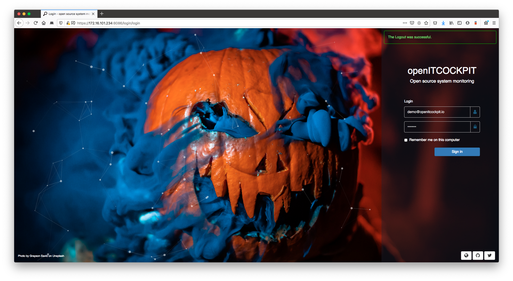
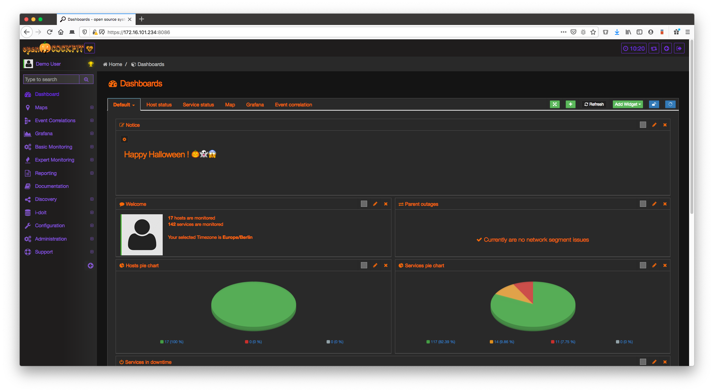

# oitc-helloween-theme
Scary helloween theme for openITCOCKPIT 🎃👻




## Requirements
- openITCOCKPIT >= 3.7.1
- DesignModule

## How to use

1. Go to **Configuration** -> **Design** -> **Import Design** and drag and drop upload the file `openITCOCKPIT-helloween.json`.
Than press on `Save`

2. Upoad `oitc-hallowenn.png` as Logo and `oitc-hallowenn-small.png` as small logo and press on `Save`.

3. copy the images from `login_bg` to `/usr/share/openitcockpit/app/webroot/img/login_bg`.

4. Patch the file `/usr/share/openitcockpit/app/webroot/css/login.css`

```diff
--- /usr/share/openitcockpit/app/webroot/css/login.css	2019-10-31 10:10:41.783120611 +0100
+++ /usr/share/openitcockpit/app/webroot/css/login.css.bak	2019-10-31 10:09:34.884875427 +0100
@@ -116,12 +116,12 @@
 }

 .login-screen > figure:nth-child(1) {
-    background-image:  url('/img/login_bg/grayson-savio-QLtHhwOnuuI-unsplash.jpg');
+    background-image:  url('/img/login_bg/spacex-71870.jpg');
 }

 .login-screen > figure:nth-child(2) {
     animation-delay: 15s;
-    background-image:  url('/img/login_bg/neonbrand-ASNSoeead70-unsplash.jpg');
+    background-image:  url('/img/login_bg/nasa-53884.jpg');
 }

 @keyframes imageAnimation {
```

5. Patch the file `/usr/share/openitcockpit/app/View/Login/login.ctp`
```diff
--- /usr/share/openitcockpit/app/View/Login/login.ctp	2019-10-31 10:12:36.932035053 +0100
+++ /usr/share/openitcockpit/app/View/Login/login.ctp.bak	2019-10-31 10:12:10.768743266 +0100
@@ -16,10 +16,10 @@
 <?php if ($isRemoteOrVnc === false): ?>
     <div class="login-screen">
         <figure>
-            <figcaption>Photo by Grayson Savio on Unsplash</figcaption>
+            <figcaption>Photo by SpaceX on Unsplash</figcaption>
         </figure>
         <figure>
-            <figcaption>Photo by NeONBRAND on Unsplash</figcaption>
+            <figcaption>Photo by NASA on Unsplash</figcaption>
         </figure>
     </div>
 <?php else: ?>
```


# Thanks to:
- https://unsplash.com/photos/ASNSoeead70
- https://unsplash.com/photos/QLtHhwOnuuI
