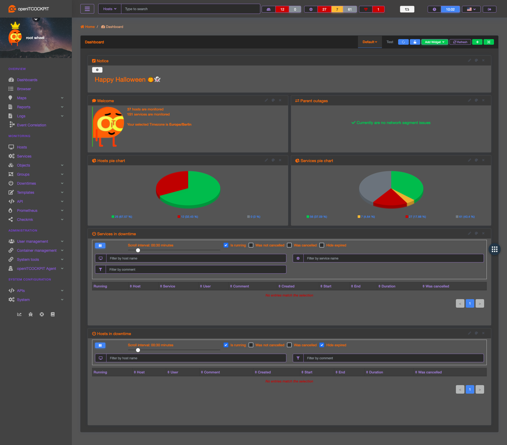

# oitc-halloween-theme
Scary halloween theme for openITCOCKPIT 🎃👻

## Requirements
- openITCOCKPIT >= 4.0.0
- DesignModule

openITCOCKPIT 3.x user? [Grab the theme for openITCOCKPIT 3.x](https://github.com/it-novum/oitc-halloween-theme/tree/3.x)

## How to use

1. Go to **System** -> **Design Editor** scroll down to the bottom and click on **Import**
Upload the file `openITCOCKPIT-design-halloween.json` and wait for the page to reload.

2. Click on **Upload logo** and select `Interface and Login` and upload the file `openitcockpit_login_logo.png`. Wait for the page to reload.

3. Click on **Upload logo** and select `Header logo` and upload the file `openitcockpit_halloween_header.png`. Wait for the page to reload.

4. Edit your user profile and upload `openitcockpit_emoji.png` as your profile image.

Happ Halloween 🎃👻
